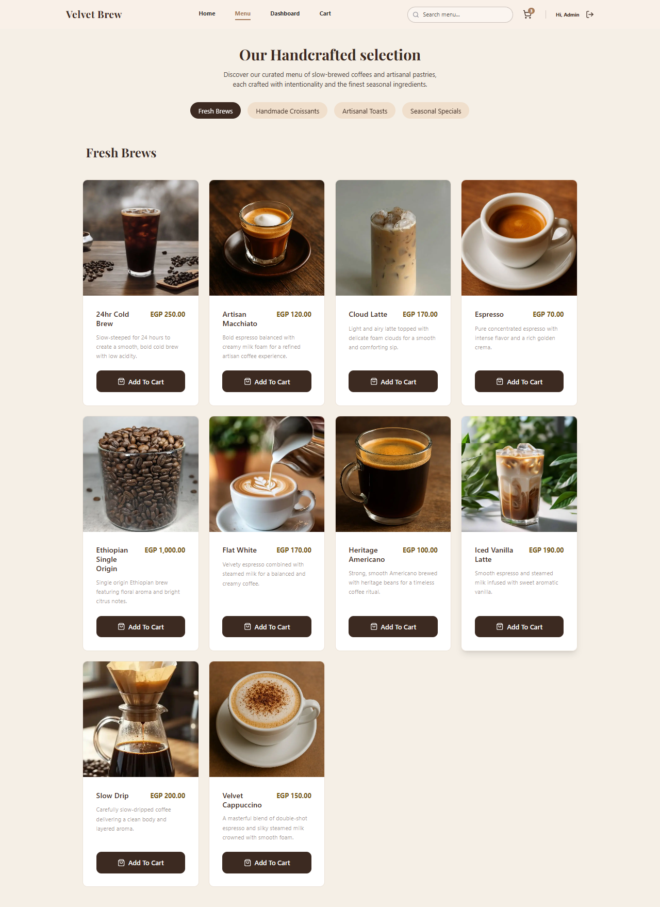
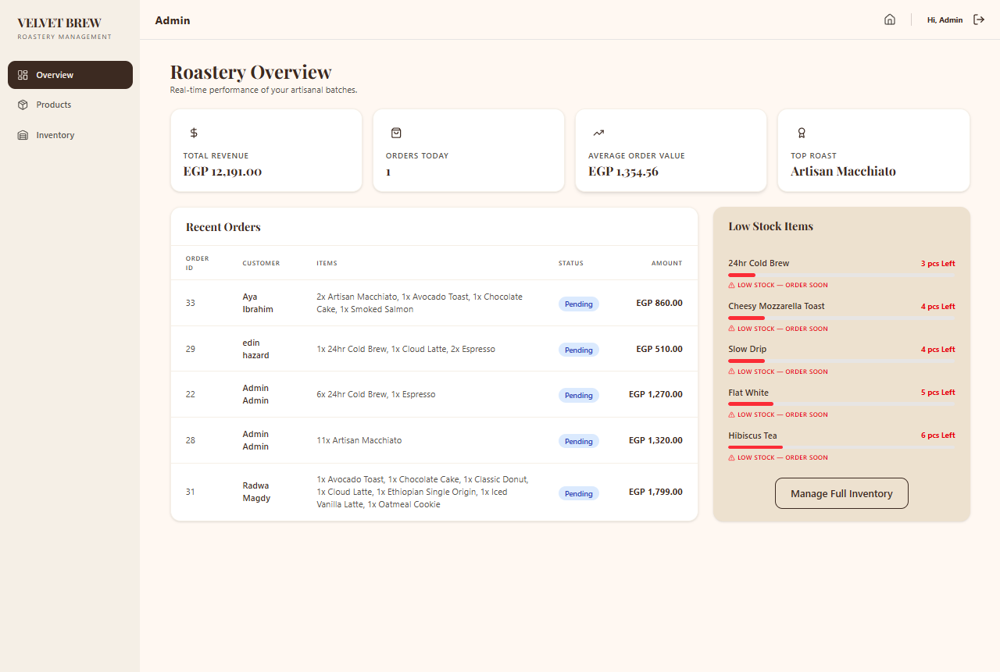
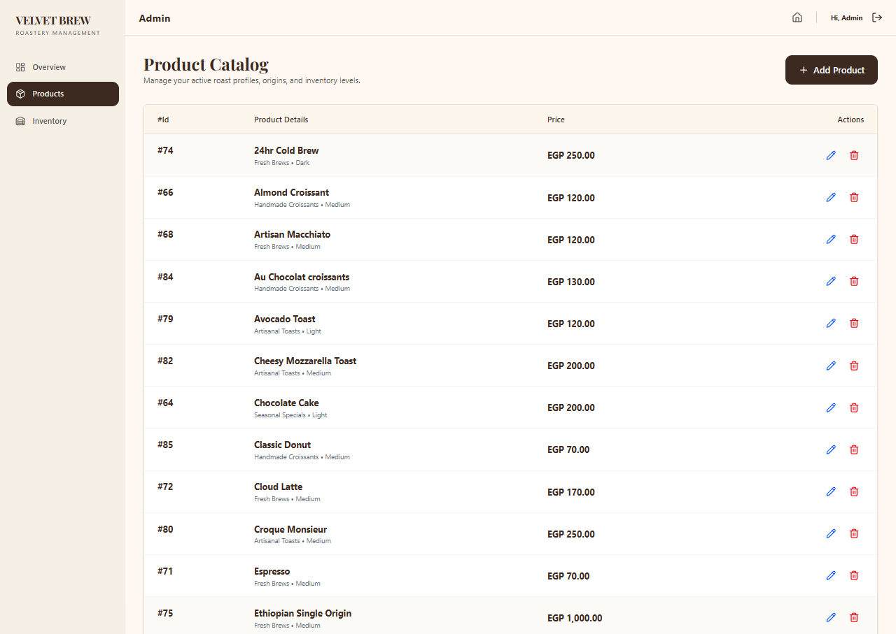
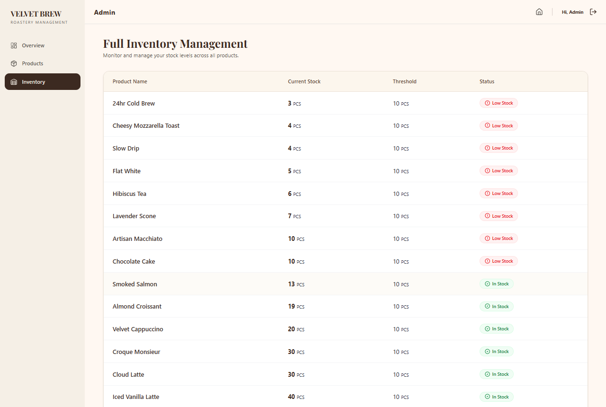

# Velvet Brew

_A modern and elegant e-commerce platform for premium coffee and desserts, designed to deliver a smooth and delightful shopping experience._

---

## 📌 Overview

**Velvet Brew** is a full-stack e-commerce storefront built with a **React** frontend and a **PHP** backend API. It enables customers to browse premium coffee products, seamlessly add items to their cart, complete orders, and manage inventory through an intuitive, fully responsive interface.

> Designed for modern online retailers who want a polished shopping experience with blazing-fast frontend interactions and API-driven product management.

---

## ✨ Features

- **Role-Based Admin Dashboard:** A secure, dynamic management panel that renders exclusively for authorized admin accounts.
- **Product listing** with categories and card-based product display.
- **Shopping cart** with add/remove item support.
- **API integration** for product, cart, order, and user data.
- **Authentication-aware** routing and protected pages.
- **Dynamic image upload support.**

---

## 🛠️ Tech Stack

| Technology            | Purpose                     |
| --------------------- | --------------------------- |
| React                 | Frontend UI                 |
| Tailwind CSS          | Styling & responsive layout |
| PHP                   | Backend API                 |
| Axios                 | HTTP requests               |
| Redux Toolkit         | State management            |
| React Query           | API data fetching & caching |
| React Router DOM      | Client-side routing         |
| React Hook Form & Yup | Form handling               |
| Swiper                | Carousel / slider UI        |
| Lucide & Lucide React | Icons                       |
| React Hot Toast       | Notifications               |
| Vercel                | Frontend deployment         |

---

## 📁 Project Structure

```text
📦 Velvet-Brew
├── 📂 src/
│   ├── 📂 api/          # API interaction modules & endpoints
│   ├── 📂 components/   # Reusable UI components
│   ├── 📂 guards/       # Guards for Protected pages
│   ├── 📂 hooks/        # Custom React hooks
│   ├── 📂 pages/        # Page views and routing components
│   ├── 📂 store/        # Redux state slices and store config
│   ├── 📂 UI/           # Layout and UI helper elements
│   └── 📂 utils/        # Utility functions and helpers
├── 📂 public/           # Static assets
└── 📄 index.html

```

---

## 🚀 Installation & Setup

1. Clone the repository:

```bash
git clone https://github.com/shefo72/Velvet-Brew.git
cd Velvet-Brew
```

2. Install dependencies:

```bash
npm install
```

3. Create a `.env` file if needed and configure API settings:

```env
VITE_API_BASE_URL=https://velvetbrewapi-production.up.railway.app/api
VITE_IMGBB_API_KEY=YOUR_IMGBB_API_KEY
```

4. Run locally:

```bash
npm run dev
```

---

## 📸 Screenshots

### 🏪 Storefront

_Modern and intuitive shopping experience._


### 🔐 Admin Dashboard (Role-Protected)

_Exclusive dashboard for administrators to manage inventory and orders._



